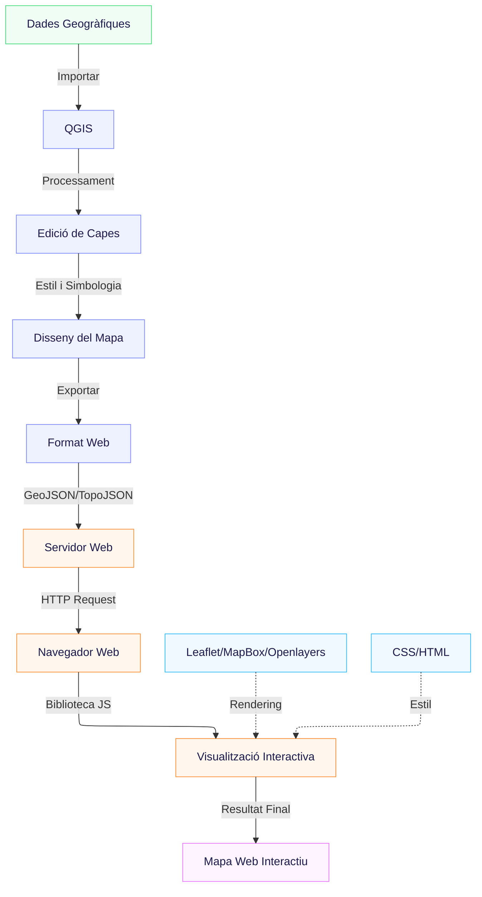

# Pàgina de proves

Aquesta és una pàgina multiproposit creada per la assignatura WebGIS...

## Inici

Per a utilitzar aquest repositori es pot:
* Descarregar els fitxers...
* Clonar el repositori: `git clone https://github.com/benizar/webgis-demo.git`
* Fer un fork del repositori

## Errors i suggeriments

## Creadors

## Copyright and License

La llicencia es pot trobar en [MIT](https://github.com/benizar/webgis-demo/blob/gh-pages/LICENSE)...

## Exemple de mermaid

